Contents

Part 1 - Core controls and system overview

Part 2 - Tactical Mode / Squad Level

Part 3 - Strategic Mode / Squad Level

Part 4 - Tactical Mode / High Command

Part 5 - Strategic Mode / High Command

---

# Part 1 - Core Controls and System Overview

A3C Architecture

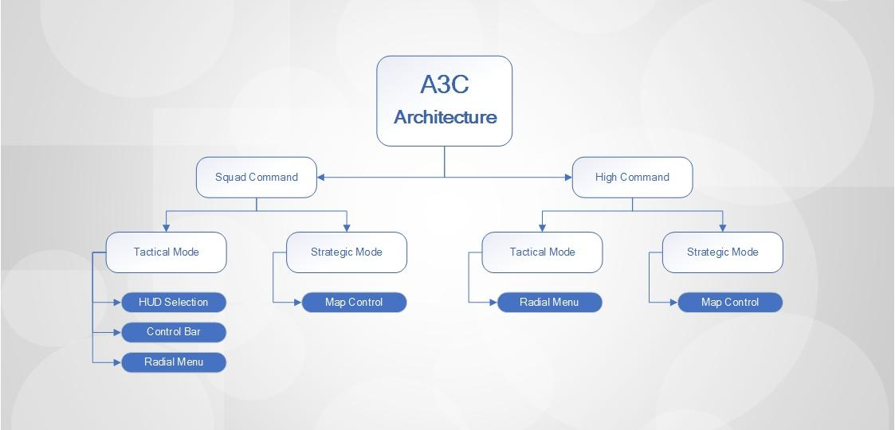

## Control Sheet

These keybinds can be changed in the Arma control menu:

Main menu → Controls → Addon Options → A3C controls

### Default controls

|  |  |
| --- | --- |
| Open 3D menu | Tab |
| Open 3D menu (CursorObject) | Ctrl + Tab |
| Open HUD MENU controls | L-Shift |
| Toggle Command Overlay | C |
| Configure Suppression Zone | Alt + T |
| Lock Formation | L |
| GetTactical Grenade | H |
| A3C-ZEUS Exit | Shift + Y |
| HUD Select: All units | 4 |
| HUD Select: Team Red | 5 |
| HUD Select: Team Green | 6 |
| HUD Select: Team Blue | 7 |
| HUD Select: Team Yellow | 8 |
| HUD Select: Team White | 9 |
| HUD Select: Unit 02 | Ctrl + F2 |
| HUD Select: Unit 03 | Ctrl + F3 |
| HUD Select: Unit 04 | Ctrl + F4 |
| HUD Select: Unit 05 | Ctrl + F5 |
| HUD Select: Unit 06 | Ctrl + F6 |
| HUD Select: Unit 07 | Ctrl + F7 |
| HUD Select: Unit 08 | Ctrl + F8 |
| HUD Select: Unit 09 | Ctrl + F9 |
| HUD Select: Unit 10 | Ctrl + F10 |
| HUD Select: Unit 11 | Shift + Ctrl + F1 |
| HUD Select: Unit 12 | Shift + Ctrl + F2 |
| HUD Select: Unit 13 | Shift + Ctrl + F3 |
| HUD Select: Unit 14 | Shift + Ctrl + F4 |
| HUD Select: Unit 15 | Shift + Ctrl + F5 |
| HUD Select: Unit 16 | Shift + Ctrl + F6 |
| HUD Select: Unit 17 | Shift + Ctrl + F7 |
| HUD Select: Unit 18 | Shift + Ctrl + F8 |
| HUD Select: Unit 19 | Shift + Ctrl + F9 |
| HUD Select: Unit 20 | Shift + Ctrl + F10 |
| Send To Hud Indicators: Regular | Space |
| Send To Hud Indicators: FW Peel | Ctrl + Space |
| Send To Hud Indicators: BW Peel | Alt + Space |
| Switch between SQUAD and PLATOON Level | Ctrl + Space |

### Controls not bound by default

These keybinds can be changed in the Arma control menu:

Main menu → Controls → Addon Options → A3C controls

|  |  |
| --- | --- |
| Activate GoCode A via Key (VA) |  |
| Activate GoCode B via Key (VA) |  |
| Activate GoCode C via Key (VA) |  |
| Activate GoCode D via Key (VA) |  |
| Squad Patch Up via key (VA) |  |
| Toggle AUTOCOMBAT for selected units via key (VA) |  |
| Refresh Squad via key (VA) |  |
| A3C FallBack / ReGroup (VA) |  |
| Reset Looking direction for selected units via key (VA) |  |
| Set Hud-Stance to AUTO via key (VA) |  |
| Set Hud-Stance to STAND via key (VA) |  |
| Set Hud-Stance to CROUCH via key (VA) |  |
| Set Hud-Stance to PRONE via key (VA) |  |
| Set Hud-Stance to NO CHANGE via key (VA) |  |
| Order selected units to STANDBY (VA) |  |
| Order selected units to CONTINUE after HOLD (VA) |  |
| Unload other groups from your vehicle (VA) |  |

### Hard coded keybinds:

These controls are native to the A3C system and cannot be changed.

Direct View Selection: ‘CTRL + ALT + Right Click’

#### HUD controls

Confirm order: ‘Space’

Cancel order: Right mouse button / Release TAB (where applicable)

Show HUD control bar: SHIFT

Direct View Selection A3C: ‘CTRL + ALT + Right Click’

Direct View Selection Vanilla: ‘Ctrl + Right Click

Adjust orientation of selection: ‘mouse wheel’

Adjust spacing of visual indicators ‘ctrl + mouse wheel’

Radial menu: ‘TAB’

Go directly to context sensitive radial menu item: ‘CTRL + TAB’

Forward peel on mouse: ‘SHIFT + CTRL + Right Click’

Backward peel on mouse: CTRL + ALT + Right Click’

#### Map controls

# Part 2 - Tactical Mode / Squad Level

Squad Level HUD Mode provides a range of different controls and functions that can be used in 1st/3rd person view:

1 - Unit/Group Selection and Positioning

2 - HUD Control Bar

3 - Radial Menu

4 - Formation Selection

5 - Player Preferences

## 1 - Unit/Group Selection and Positioning

The AI units within your immediate squad can be positioned in the 3D world using the A3C visual indicators.

To select one specific unit in your squad press ‘Ctrl + F2, F3’ etc. You then are given the move indicator on screen for each unit selected.

After you have selected your units, the indicators can be moved around your environment simply by looking around.

To give the move order, press ‘space’ while looking at the spot to where you want the selected squad members to move to.

There are two kinds of indicators available:

|  |
| --- |
| 1. VR units 2. Circular discs |

The VR unit indicators deliver a more visual representation of the resulting move, while the stylized circular indicators are less obtrusive.

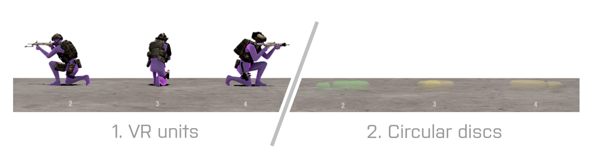

The real power in A3C lies in bulk selection by team colors. It will enable you to easily and precisely perform advanced tactical maneuvering of your squad, such as team bounding over open terrain or through a town for example.

That is done through pressing the number keys 4-9:

|  |
| --- |
| 4-key: all units 5-key: red team 6-key: green team 7-key: blue team 8-key: yellow team 9-key: white team |

Note: You can switch between the visual indicators in A3C preferences.

|  |
| --- |
| Press TAB → Click the gear icon in the lower right corner of the screen → Toggle the setting for “Use unit-HUD” to ON. |

You can change the orientation of your selection using the ‘mouse wheel’, and also adjust spacing in between each visual indicator by using ‘ctrl + mouse wheel’.

Dragging the indicators close to walls and most objects will make them snap into place. That will make it easy to line up units along features in the terrain with covering sectors out from the object.

[Picture showing units lined up on a wall, NOT the forward facing formation as it will be explained in detail below]

With selection indicators active, you can easily move units into available building and rooftop positions, simply by looking at the building in question. If there are available pre-configured positions in that building, A3C will display these as move options for your team.

Note: if you wish to position your units ‘outside’ of a building, simply look at the base of the building to snap the visual markers to the exterior perimeter.

When the first indicator in a selection is moved further away from the player than 20m, or when it’s obscured by a building wall, an additional placer icon will show each unit’s team color. This provides more precise visual feedback when there is no direct line of sight.

##### Direct View Selection: ‘CTRL + ALT + Right Click’

Similarly to vanilla Arma 3 controls, you can select any squad member you are looking directly at with ‘Ctrl + Alt + Right Click’.  In the same manner, you can select units in Arma 3 space with ‘Ctrl + Right Click’. These selections will also stack, meaning you can add as many units to your selection as you like by repeating the action.

## 2 - HUD Control Bar

The HUD Control Bar provides the user with a very quick system of controls for movement of the AI. This includes travel speed, formations, stances and go-codes.

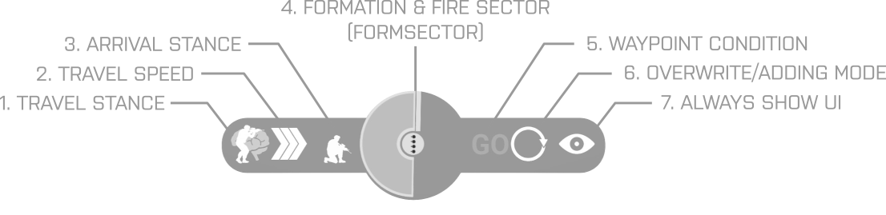

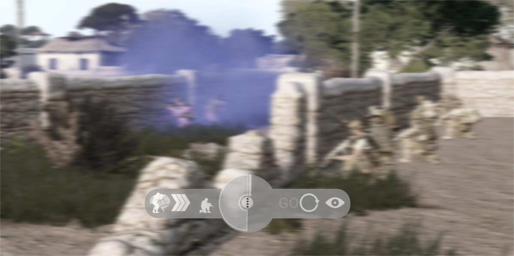

The HUD control bar becomes visible whenever you have units selected with visual indicators. It functions as a feedback mechanic, and becomes accessible when holding down the ‘LEFT SHIFT-key’.

There are three distinct sections of the HUD control bar:

- Stance and speed controls
- Formation selector
- Conditions

### HUD Control Bar - Stance and Speed Controls

The leftmost icon represents travel stance, the middle icon (chevron) indicates travel speed, the third icon indicates stance on arrival.

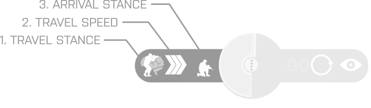

You can cycle through panel settings using both left and right mouse buttons, or you can hover over the particular item and use the mouse scroll wheel.

### HUD Control Bar - Form Selector

The large circular icon in the centre of the Control Bar is the ‘Form Sector icon’.

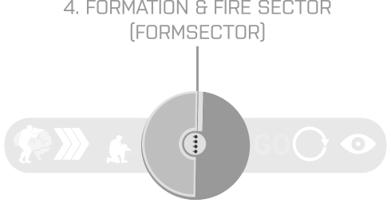

This icon’s main purpose is to give the user direct feedback and control of how the selected set of AI will be oriented, even when the indicators aren’t clearly visible. It also shows the resulting firing sector for the current formation and orientation.

By holding down ‘shift’ and clicking the Control Bar center icon it is possible to switch between formations.

|  |
| --- |
| 1. Line formation right (180 degree firing sector) 2. Line formation left (180 degree firing sector) 3. Line formation front (all units facing front, as indicated by arrow) 4. L formation (275 degree firing sector) 5. Staggered column 6. Circle formation 7. Been Enhanced Movement (currently addon-dependent) |

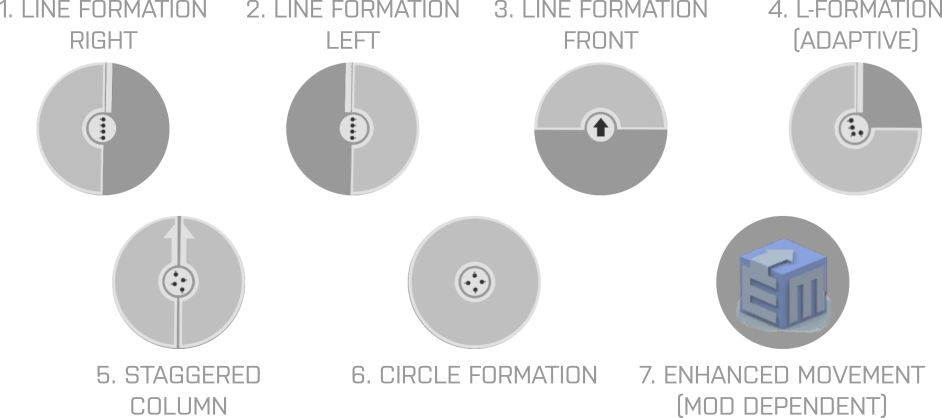

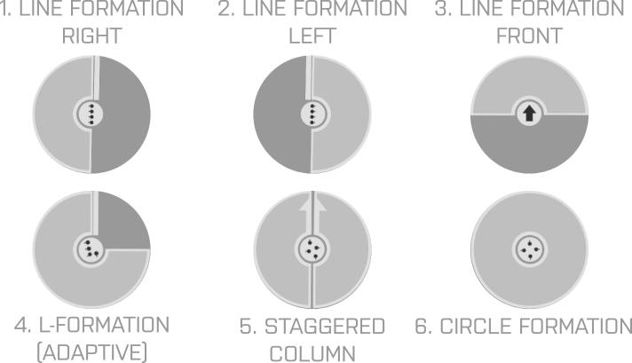

As visual indicators for selected units snap to objects in the terrain, the Formation Center Icon will automatically change to reflect that.

The line formations will cover as much as possible of a 180 degree sector that the number of units allow for. The formation will be automatically directed away from any surfaces it is snapped onto.

There is an exception with a formation that points all units to face the obstacle. This is especially useful for setting up a firing line along a low wall for example.

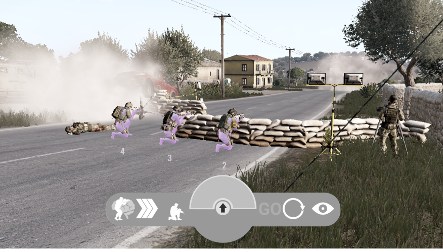

### L-formation

The L-formation is designed to let you place units around a building corner. When it is snapped onto a surface, it will adapt itself to the corner depending on how close the units are placed.

[Needs a good in-situ example]

### Circle formation

The circle formation will distribute the selected AI across the perimeter of a virtual circle, where they can be faced outward or inward. By facing them outward they will naturally provide good all-around sector coverage and security (e.g. this can be used to set up a 360 degree security ring in advance of a helicopter landing). Facing them inwards allows the player to position them around ammo crates, buildings, or sets them up for briefings.

To change the size of the circle: ‘CTRL + scroll wheel’.

Unit orientation inward: ‘scroll wheel up’

Unit orientation outward: ‘scroll wheel down’

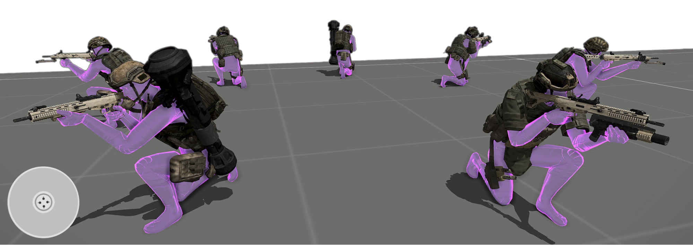

### HUD Control Bar - Conditions

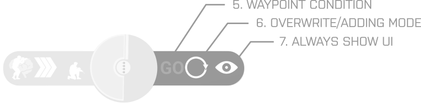

The next two icons on the right side of the Form Selector as highlighted above are your ‘conditional controls’.

The leftmost icon (Go / A / B / C / D) enables you to create and manage ‘go-codes’. The centre icon (that toggles from a circle to a plus sign) allows you to switch between two distinct control modes: ‘override mode’ and ‘adding mode’.

The right-most eye icon will toggle the visibility of the panel.

Go-Codes

Go-codes (Go / A / B / C / D) offer the player a powerful control mechanic, enabling detailed and staged offensive actions, both in tactical mode and strategic mode. It will be covered in the section at High Command level. More detail regarding use of Go-Codes can be found in the advanced usage section here.

Control Modes

While in ‘override mode’ (represented by the ‘circle’ icon), the player’s movement order is always carried out immediately. When one or more units are selected (and you are in control of the visual indicators), once you give your move order (by pressing space), the unit(s) will move to that location, and the indicators will disappear. This is the default mode in A3C. This mode essentially orders your assets to move immediately to your chosen space.

The alternative control mechanic - adding mode - enables the player to effectively ‘stack’ movement orders. With this mode selected (the plus icon), once move orders are committed by pressing ‘space’ the visual indicators remain on screen, allowing for further move orders to be added to the sequence. In this mode, units will move to each selected place in sequence. To end the sequencing mechanic, the player should ‘right click’ to remove the visual indicators.

Note: move orders chosen via ‘adding mode’ will appear in the map, and can be repositioned here accordingly if needed.

Note: move orders given in TACTICAL mode will also appear in the map, and can be edited or expanded there if needed.

Show / Hide UI

The final element on the far right side of the bar shows or hides the UI. The default setting is “UI: Shown” which means it will always be visible.

[show hud control bar with highlighted visibility icon]

With the benefit of a less cluttered screen, this option can be set to “UI: Hidden” .

[show hud control bar with highlighted visibility icon]

This means that the HUD Control Bar will be shown on screen only while you hold down ‘shift’’ to access it.

## 3 - Radial Menu: ‘TAB-key’

The Radial Menu is a core feature of A3C and shared by both SQUAD and HIGH COMMAND levels. It enables access to an extensive range of features and functions.

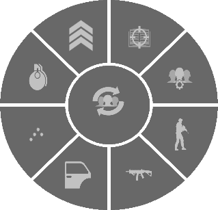

The Radial Menu is made up of 8 segments, and a centre icon. Hovering over each segment will open up further menu segments with further configuration and selection options.

To activate the Radial Menu, press and hold ‘Tab’ (i.e. this function can be considered ‘Push To Use’). While activated your mouse cursor will also be active, allowing you to make menu selections. Once you release ‘Tab’, the menu closes.

Note: Releasing ‘Tab’ will in some cases also act as a way to cancel actions.

There are several ways to issue instructions for your selected units with the Radial Menu:

Method 1 - If you open the radial while not looking at a squad member, it will select all units in your squad.

Method 2 - Select one or a number of units beforehand using the standard Arma 3 selection keys. If you then open the Radial menu, any instructions issued from the radial menu will affect only those pre-selected units.

Method 3 - If you look directly at a squad member, and press & hold ‘ctrl + tab’, the radial system will apply only to that specific unit.

Method 4 - You can also move your mouse to the left of the radial to open up the ‘Unit Selection Panel’ and select units through that.

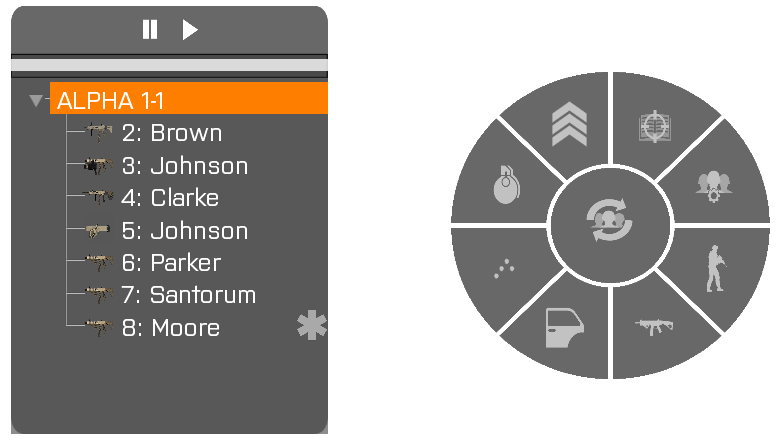

You can use the standard ‘ctrl + click’ and ‘shift + click’ to select multiple list items.

The unit list also allows for assigning color teams. Make your selections in the list, hold down shift and click the right mouse button on the selection to bring up a menu.

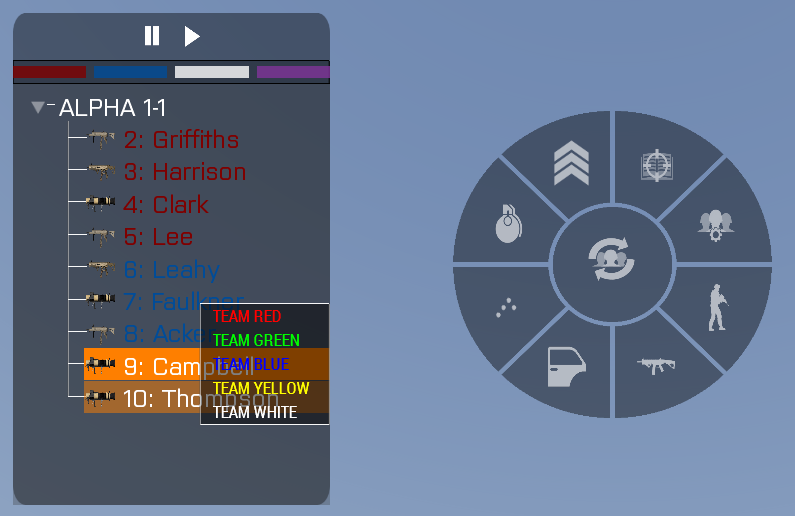

Every available team is represented in the segmented color bar at the top of the list (note: purple represents selection of the entire squad across all colour teams).

Left clicking a colour segment will select the team in vanilla mode.

Right clicking a color segment will select the team in A3C mode with visual indicators.

## Radial Menu Actions

The Radial Menu itself has 9 core sections:

### Radial Menu Actions 1 - Refresh / Regroup

This function has two core responsibilities.

A player can easily bring units back into formation simply by pressing the button with ‘right mouse button’.

A player can also reformat unit positions by ‘left clicking’, ensuring that any units lost in battle are removed from the active squad list (making things more efficient for the commanding player by backfilling any unit places lost during battle).

### Radial Menu Actions 2 - Rules of Engagement (RoE)

There are four elements available in this function:

|  |
| --- |
| 1. Fire at will (FAW) 2. Fire only at designated targets (FOADT) 3. Fire on my lead (FOML) 4. Engage/Disengage Auto-Combat (EDAC) |

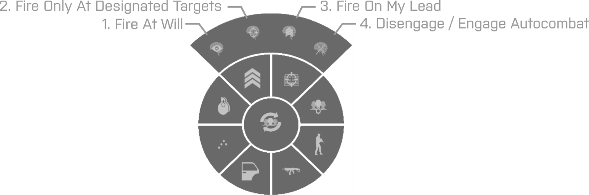

Fire at will (FAW): This is the default setting which will allow AI squad members to select and fire upon enemies if no other conditions prevent them from doing so.

Fire only on designated targets (FOADT): This removes the unit’s ability to ‘auto-target’. Using this mode, units will only be able to target things designated by the player. Note: this can be useful when you need to ensure that your team takes out a specific individual while ignoring less valuable [other] targets (i.e. stealth missions).

Fire on my lead (FOML): This prevents all units from firing until you fire the first shot. Note: this can be useful when you need to ensure that your team only commences their attack when you start shooting (e.g. ambush situations).

Engage/disengage auto-combat (EDAC): Prevents AI from entering into combat mode automatically.

Note 1: you can combine “Fire at designated targets” and “Fire on my lead” for tactical advantage. If you enable “Fire on my lead”, then designate targets using “Fire only on designated targets”, your team will only engage the specific targets when you fire the first shot.

Note 2: Selecting “Fire at will” will reset everything to default.

Note 3: Disengaging Auto-Combat can be useful when trying to move your units quickly while under enemy fire (e.g. while retreating).

## Radial Menu Actions 3 - AI Auto Functions

This area of functionality is represented by the brain icon, and contains the following 4 additional menu systems:

### AI Auto Functions 1 - Reset looking direction

Resets Looking Direction to the default “AUTO” or “NONE” for a unit that has been set to watch a specific direction previously. This type of reset is unavailable in the vanilla game controls and is therefore provided here.

IMAGE NEEDED

### AI Auto Functions 2 - Medical Options

This section allows the player to quickly and easily manage automatic healing actions within the squad. It will display lists for both potential healers and potential patients.

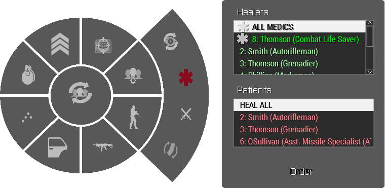

Healers are units that carry at least a First Aid Kit (FAK) or a Medpack. The FAKs are single-use and will expire on use. Medpacks can be used repeatedly and are effectively unlimited.

The ‘Patients’ section lists all injured squad members including the player.

The quickest way to get the entire squad healed is to select ALL MEDICS as healers and the HEAL ALL option as patients and then press the “Order” button. Any unit carrying a FAK (First aid Kit) will use that to heal themselves. If they do not have the resources to heal themselves, another unit in the squad will heal them.

The most efficient and economical way to heal all the units in a squad is to have a unit with a Medpack treat all injured units. Select the unit with the Medpack and then choose “Heal all” in the Patient list. That will make the AI go around the squad members and heal each one with the Medpack.

After a medic unit has treated all available patients, it will either fall back into formation if it was in formation when the healing order began, or if the unit was stationary before it started healing, it will return to the location it started from.

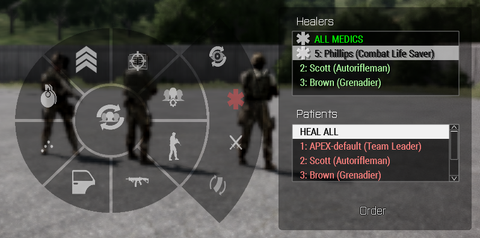

### AI Auto Functions 3 - Behaviours and Combat Modes

This radial menu item enables you to apply behaviours and combat modes to individuals within your squad.

IMAGE NEEDED

Note that the vanilla commands will override the A3C level commands. If a Stand order has been issued with the vanilla action menu. These commands will have no effect until a vanilla “Automatic stance” order has been issued.

### AI Auto Functions 4 - AI Rearming

You can apply this functionality to a single unit, or to a group.

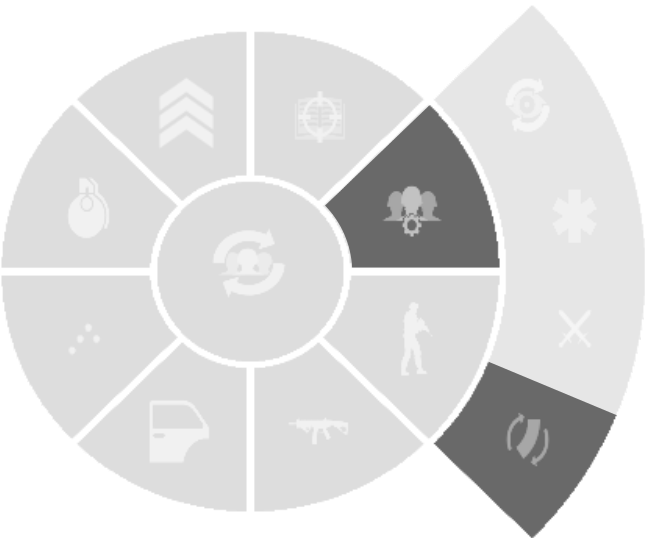

If multiple units are selected, only the first of two options will be available - this shows containers and what they have inside of them - but you do not have the ability to interact with those specific items. If you select 'rearm' the selected units will move to the specified container and rearm automatically.

If you select a unit individually, you can either apply the same process as above, or you can double click on a specific item within the ammo crate or vehicle to make the unit pick up these items one by one.

Individual unit-selections also have the additional ‘INVENTORY’ option which makes the unit run to the container, opening it’s inventory for full interaction with the container.

Single units can also take advantage of ‘staked rearm orders’, If there are multiple sources nearby, you can sequence the unit to visit different ammo sources. At each source you can also specify items to select in each source. This enables the commanding player to specify exactly what items your AI squad-mate takes, across multiple sources.

## Radial Menu Actions 4 - AI Stances

This section enables the player to issue stance orders to selected units (prone, crouch, stand and auto).

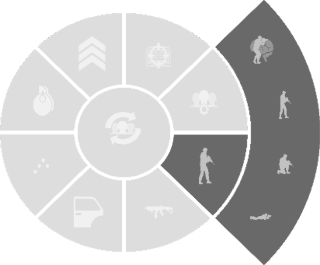

Note: if you right click on the stances radial icon, you can access the 4 go-code options, enabling any goCode that a unit might be waiting for. Learn more about Go-Codes here.

Note: there is a right click macro on the AI Auto Functions (brain icon) - this makes all selected units reset their looking direction, and sets their stance to auto.

## Radial Menu Actions 5 - Weapon Items

This section allows the player to toggle primary and secondary weapons for units under their direct command (attach or detach IR strobes, toggle NV-goggles for).

This mechanic also enables commands to attach / detach silencers, and turn laser pointers on or off.

Note: that this will temporarily force the AI units to enter into Combat mode, so using it with crouch or standing stances is recommended to prevent the units from going prone.

IMAGE NEEDED

## Radial Menu Actions 6 - AI Vehicle Boarding

The Vehicle Management Section allows for a quick and precise vehicle ordering for squad AI.

Only vehicles available to the squad show up as icons representing a vehicle class. Available classes are:

|  |
| --- |
| 1. Cars 2. Tanks 3. Helicopters 4. Planes 5. Boats 6. Static weapons |

Clicking on the vehicle class (1) opens a window to the right, showing you a selection of vehicles that are close enough to your selected AI.

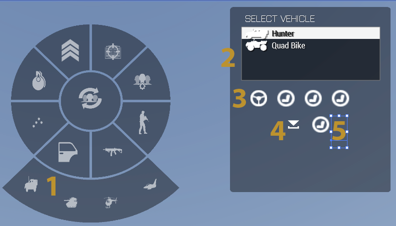

Once you select a vehicle from the list (2), available seat spaces will be shown to the right (3). White icons indicate that the seat is empty, transparent blue ones indicate that the seat assigned to a boarding unit (who is still making their way to the vehicle), red icons indicate that the seat is actively occupied. 

Left clicking on empty seat icons will make any selected unit board that seat. Right clicking will either dismount the unit or cancel an active boarding process.

There are two macro buttons for usage with multiple units. You can board units to any free seat including driver/gunner/commander (4). Or you can choose to man only cargo and FFV positions (5).

To have all selected units dismount, ‘right-click’ the door button.

Tip: ‘CTRL + TAB’ While looking at a vehicle will automatically open the boarding menu for that vehicle.

## Radial Menu Actions 7 - Formations

The formations menu will give the user quick access to each of the various vanilla formations for the squad. Each icon clearly conveys what formation the AI squad members will take up around the player.

IMAGE NEEDED

## Radial Menu Actions 8 - GTI Precision Grenades

### (Selection + spacebar)

With credit to Zapat, creator of Get Tactical

This radial feature enables very specific controls over grenade trajectory, both for the commanding player and any squad AI. This level of control can be used to ensure grenades are thrown successfully through open windows or doors, preventing unwanted (and potentially lethal)rebounds.

A3C will show a selection of available items (frags, smoke etc) based on the selected unit’s inventory.

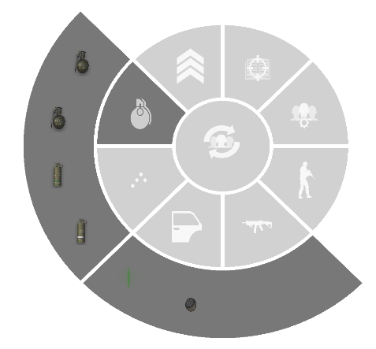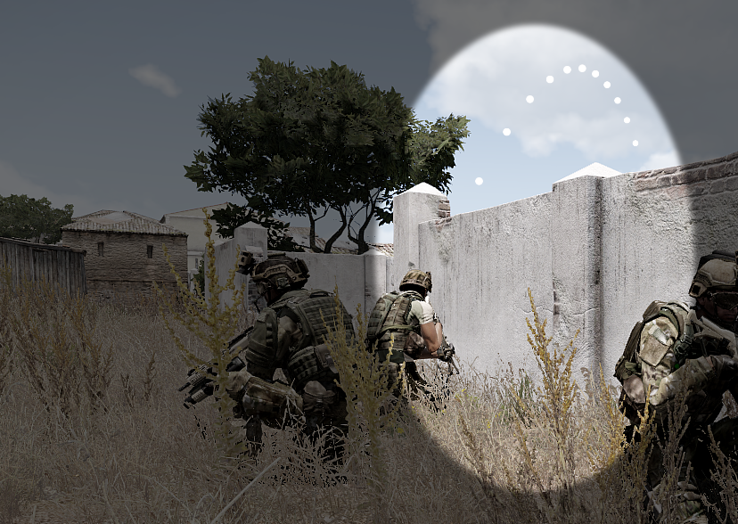

Note: keep holding ‘TAB’ while making your item selection. Once selected, the radial menu will disappear and display a throwing arc originating from the unit set to throw the item.

To confirm throw: ‘Spacebar’

To cancel operation: Release ‘TAB’

## Radial Menu Actions 9 - AI Actions

This menu section provides a range of actions that can be performed by the AI:

|  |
| --- |
| 1. Find cover 2. Suppression position 3. Assemble static weapon 4. Fire AT-rocket 5. Fire UGL grenade 6. Place explosives 7. Open inventory 8. Unstuck unit(s) |

#### IMAGE NEEDED

#### AI Actions 1 - Find cover

This instructs the selected units to find any available cover or concealment. The specifics (decisions) are not covered here, but will usually relate to known positions of enemy troops.

Units will usually try to find ‘hard-cover’ first, but failing that they will make an attempt to conceal themselves or as  alast resort simply take up a prone position.

#### AI Actions 2 - Suppression

This allows for precise direction of suppressive fire by the currently selected AI.

Clicking the icon  will close the radial menu and display the same icon as a placement indicator snapped to the terrain 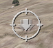.

Position the indicator at the relevant target area.

Confirm fire: ‘Space’

Cancel giving order: ‘Release TAB’

Any selected AI with control of a weapon will start firing, both as infantry and on vehicle guns.

To stop AI firing, click the “cancel suppression” icon  in the radial menu that has now replaced the suppression icon.

There is a secondary suppression menu - activate it by pressing Alt +T. Here you can specify conditions for when to stop suppressing. These settings will also affect the regular radial menu suppression.

|  |
| --- |
| 1. Unlimited 2. Used Ammo 3. Used MAgazines 4. Time Elapsed |

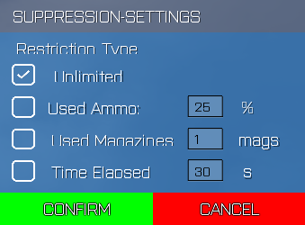

Unlimited: Units will fire until ammo is gone

Used Ammo: Units will use a set percentage of their ammo

Used Mag: Units will use specified number of magazines

Time elapsed: Units will suppress for the specified time in seconds.

With this setting open you can also designate a fire zone by clicking and dragging to define a box over the desired area.

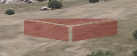

When you are done with the settings, click either ‘Confirm’ to initiate suppression or ‘Cancel’ to just close the dialog.

While the suppression order is being carried out by the AI, the suppression area can be changed on the fly in the map. Open the map while suppression is active and move the corners of the polygon defining the suppression area to suit your needs.

 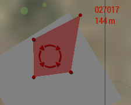

#### AI Actions 3 - Assemble Static Weapon

This option will enable instructions for your AI to assemble, operate and disassemble static weapons such as mortars or turret mounted weapons (if the units have the required backpacks).

The Radial Menu icon will represent one of any available static weapons in the group.

Clicking the icon will provide you with a 3D icon on screen, enabling the commanding player to specify exactly where they want the static system to be established.

Change orientation: ‘Mouse Scroll wheel’

Confirm placement: ‘Space’

Cancel giving placement order: ‘Release TAB’

After confirming the location, the relevant units with the required gear will move to that location and set up the weapon.

It is possible to have more than one type of static system available in the squad. In that case, clicking the Assemble Static Weapon item in Radial Menu will provide you with a list of all available systems. Selecting one of the options will then close the menu automatically.

To disassemble a static weapon, click the “Disassemble Static Weapon” icon in the Radial Menu. That will close the menu and you will see a list of assembled weapons. Select the one you want to take apart, the menu will close and the AI will put it back into storage.

Disassembly is also view-contextual, meaning that if you are looking at a static weapon when clicking the disassembly-icon, it will immediately be taken down without showing a menu.

Note: this is compatible with IFA3 as secondary weapons instead of backpacks.

#### AI Actions 4 - Fire AT-Rocket

This will let you have rocket launcher equipped AI fire exactly on a location or at a specific enemy target.

Click on the option in the Radial menu to see the menu disappear to show an indicator that snaps to the terrain or to objects.

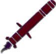

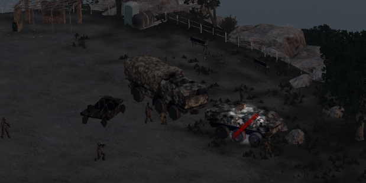

Confirm fire: ‘Space’

Cancel giving fire order: ‘Release TAB’

If the selected target is a vehicle that can be locked onto by the weapon, the projectile will then track that target.

In the case of an unguided rocket, it will simply fly toward the point in space selected with the visual indicator.

#### AI Actions 5 - Fire UGL grenade

With this mechanic it is possible to have AI shoot underslung grenade launcher (UGL) projectiles at specific targets such as windows, or points in the terrain. The option is available as long as units in your group have them equipped. Where there are multiple units with UGL capabilities, A3C will automatically select the most suitable option automatically.

Click on the option in the Radial menu. The menu will disappear to show an indicator that snaps to the terrain or to objects.

Confirm fire: ‘Space’

Cancel giving fire order: ‘Release TAB’

#### AI Actions 6- Place explosive

This will enable you to order your AI to place explosives (if equipped). Selecting the radial menu option will present a list of available explosives. After selecting the explosive option you will see an explosion indicator that will snap to the terrain or objects.

Move it to the required position or object for the explosive device.

To confirm placement: ‘SPACE’

The relevant unit will run to the designated location, set the charge and return to either their previous point, or back to formation.

If you are planning to place explosives onto a vehicle, after moving the explosive indicator to the vehicle, the dropdown list should only show you relevant explosives suitable for vehicle immobilisation such as an explosives satchel.

Once explosives have been placed, you will see a new “manage explosives” icon in the Radial Menu. Clicking that will close the Radial Menu and open a list of placed explosives. To immediately detonate one or all placed explosives, click the desired one or use the option “Detonate all charges”.

#### AI Actions 7 - Open Inventory

This action allows you to directly manage the inventory of units under your direct control. There are three options here: manage inventory of a single unit, manage the inventory of a group under your direct command, and link the inventory of a unit with that of the commanding player.

Single Unit Inventory management

Select one unit, then open the radial menu. Now select the 'open inventory' icon. This will allow you a much more detailed control of their inventory.

[what happens here ^^^ ?]

Group Inventory Management

[tbc]

Linking player with unit inventory

In addition to the main inventory management capability, if you carry out this action while within 5m of the unit you will be able to link yours and their inventory, swapping out items to suit the situation.

Eight item= Open Arsenal If your unit is closer than 10m to an item that has Virtual Arsenal, you will be able to select the 'Open Arsenal' icon to use the VA to re-arm and reequip the selected unit. Note: there is an additional list box at the top of the screen that will let you alternate between other squad members, including yourself.

#### AI Actions 8 - Unstuck unit(s)

Clicking this option will attempt to release any selected units from positions in the terrain where they may have gotten stuck. It is done through a short teleportation sequence, which can be immersion-breaking and should only be used in emergency situations.

## Teasers

### Supported Mod: Enhanced Movement

By loading the Enhanced Movement mod created by Bad Benson, the formation selector can be cycled to that option by clicking on it with either mouse button, or scrolling the mouse wheel over it:

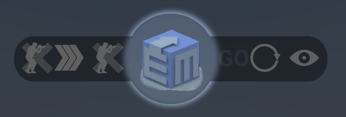

Selected units can then be ordered to perform actions supported by Enhanced Movement by snapping the visual indicators against an obstacle in the terrain and giving the movement order by pressing ‘SPACE’.

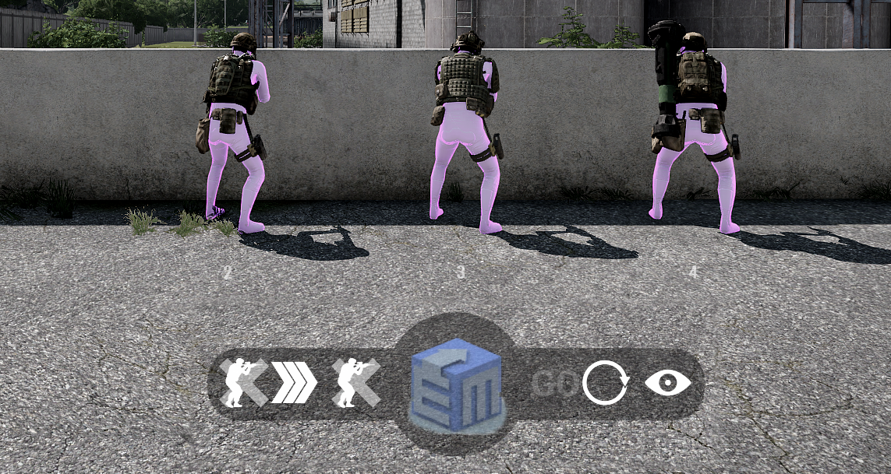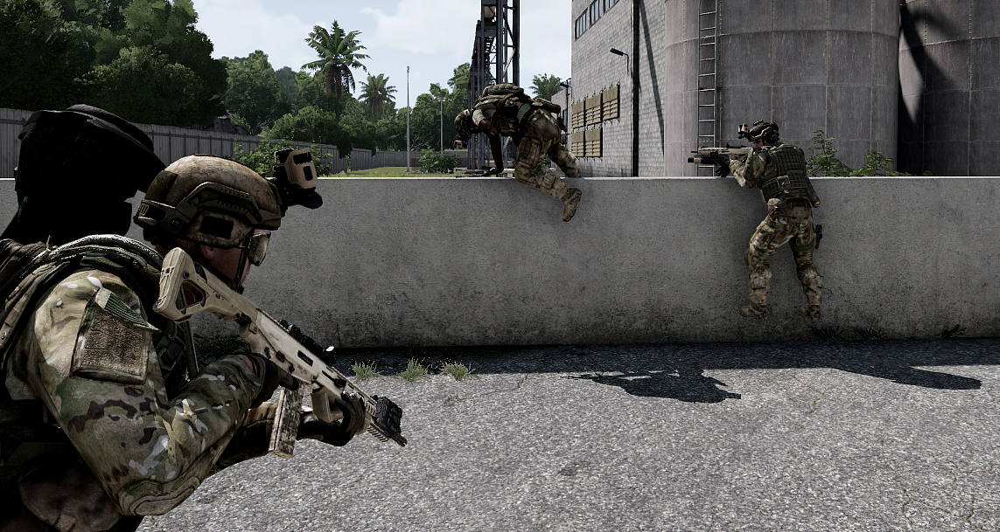

The units will move to the indicated positions and climb the obstacle.

## Preferences test

- AI-Skill reset
- Num-Controls (toggles quick-formations on Numpad keys)
- Auto Reset HUD
- AI rail
- Tablet style
- Hud-Corner-UI
- Use Unit-HUD

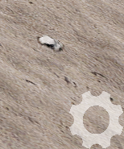

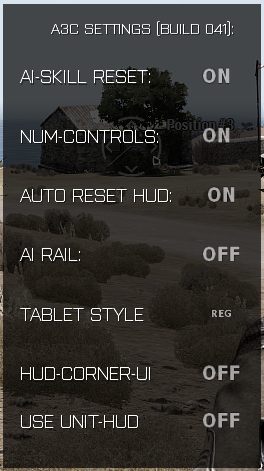

Teasers

Teaser features

Extra features

Experimental features

Additional features

Special features

\_Assigned to realmadcheese@gmail.com\_
