STRATEGIC MODE

STRATEGIC MODE enables you to take a more map-based approach to operations management. Due to the similarities of both modes, we have included instructions for both squad-level and high command in this section.

The strategic-overlay connects when you open the map. You can toggle the command-overlay by pressing ‘C’ - you will not see the overlay in any mission until you toggle it’s visibility again with ‘C’.

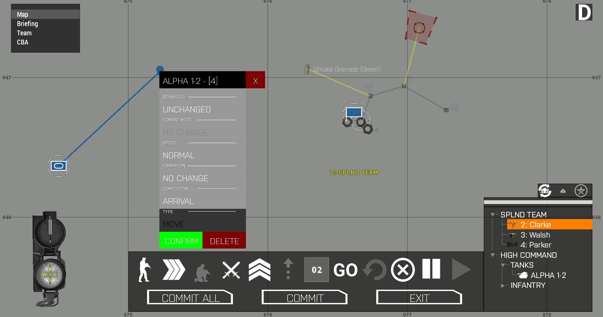

\_\_\_\_\_\_\_\_\_\_\_\_\_\_\_\_\_\_\_\_\_\_\_\_\_\_\_\_\_\_\_\_\_\_\_\_\_\_\_\_\_\_\_\_\_\_\_\_\_\_\_\_\_\_\_

SHARED CONTROLS:

\_\_\_\_\_\_\_\_\_\_\_\_\_\_\_\_\_\_\_\_\_\_\_\_\_\_\_\_\_\_\_\_\_\_\_\_\_\_\_\_\_\_\_\_\_\_\_\_\_\_\_\_\_\_\_

UNIT SELECTION

STRATEGIC MODE gives you two ways of targeting units to receive the next planning step: map selection or command tree.

1.MAP SELECTION

You can select units directly by clicking ‘Left Mouse Button’ on their map-icons.

To add or remove groups from your selection, hold ‘CTRL’ and click ‘Left Mouse Button’ on the unit’s map icon.

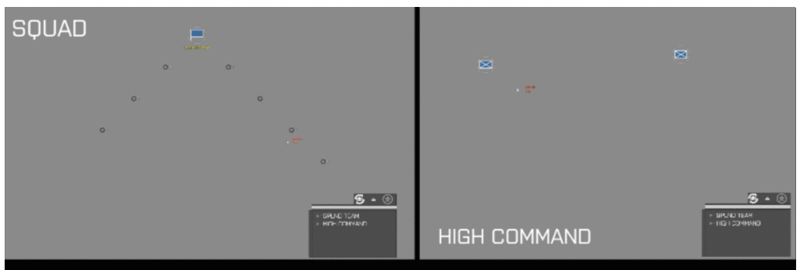

To draw a selection field, hold CTRL and drag ‘Left Mouse Button’ over the desired map-area.

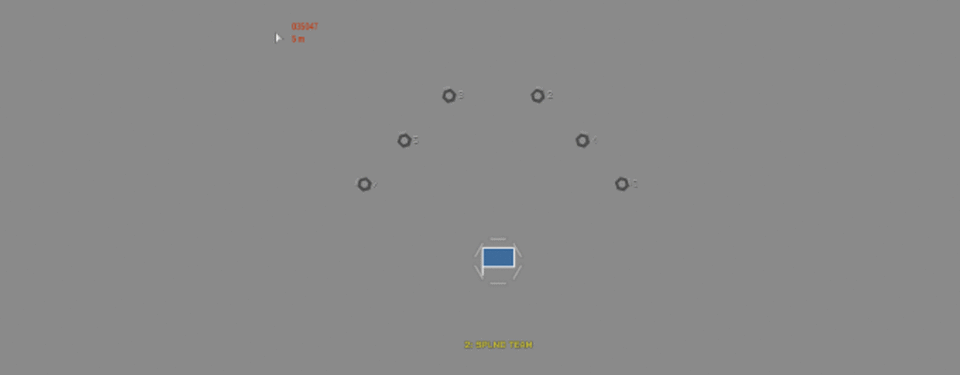

2. COMMANDING-TREE

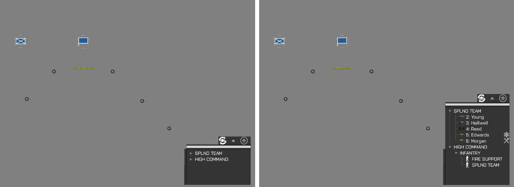

Your squad and it’s team-colors will always be listed, while the ‘HIGH COMMAND’ section is only shown if you have units under your command.

The commanding tree shares it’s functionality with the radial menu:

Units are displayed in their team-color. The units display team-color, healing/repairing capabilities and the primary weapon - if the unit has a launcher, the secondary weapon will be displayed.

Select individual units by clicking ‘Left Mouse Button’ on the unit names. Apply common ‘CTRL’ and ‘SHIFT’ techniques to select multiple units simultaneously.

To re-center the map on any unit, select it individually and click ‘Right Mouse Button’ on the commanding-tree.

ADDITIONAL COMMAND-TREE FUNCTIONS FOR STRATEGIC MODE:

‘SQUAD’:

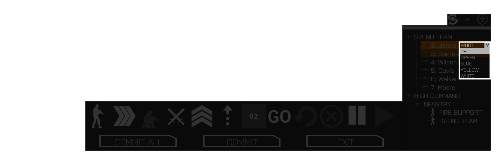

To assign team-colors to your selected squad-units, hold SHIFT and click ‘Right Mouse Button’ on the commanding-tree. Assign the team-color with the popup-selector.

‘HIGH COMMAND’:

To open the GROUP-MENU\* on your selected groups, hold down SHIFT and click ‘Right Mouse Button’ on the commanding-tree.

PLACING WAYPOINTS

To place a waypoint, click ‘Left Mouse Button’ on the map whenever you have units selected.

SQUAD LEVEL: Drag ‘Left Mouse Button’ in your desired looking direction before releasing it. Waypoints for multiple units will be distributed according to the FORMATION SETTINGS\*. SQUAD level waypoints are in ‘PLANNING STAGE’  until you commit to them - this means the plans first only exist on a theoretical level and can be modified before you commit to them.

PATH DRAWING :

You can press ‘Left Mouse Button’ on a unit, then drag the mouse away from the unit to draw a path. On SQUAD level, the unit will move along the exact path, unless facing obstructions. On HIGH COMMAND level, you can hold down SHIFT while dragging and draw a path to one of the popup-icons to quickly board a group to a vehicle.

HIGH COMMAND: Groups will move to the position immediately. A ‘planning stage’  is currently not available, similar to Arma’s vanilla High Command mechanics.

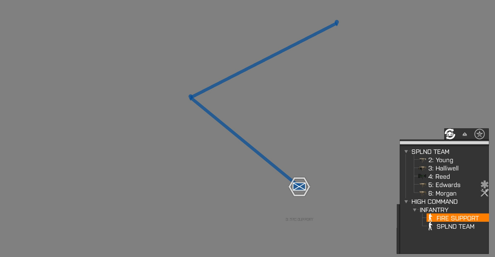

WAYPOINT SYNCHRONIZATION

Waypoints can be synchronized by holding ‘CTRL’ and dragging a sync-line from one waypoint to another. This method does not work in between ‘SQUAD’ and ‘HIGH COMMAND’ levels.

Units will not proceed to the next waypoint until all synchronized waypoints have been reached.

 

SQUAD:

HIGH COMMAND: Synchronization can also be used to load groups or vehicles into cargo space of another group’s leading vehicle. Selection icons will pop up after the waypoints have been synchronized.

Example: Using SYNC to make a VTOL land and load a wheeled vehicle.

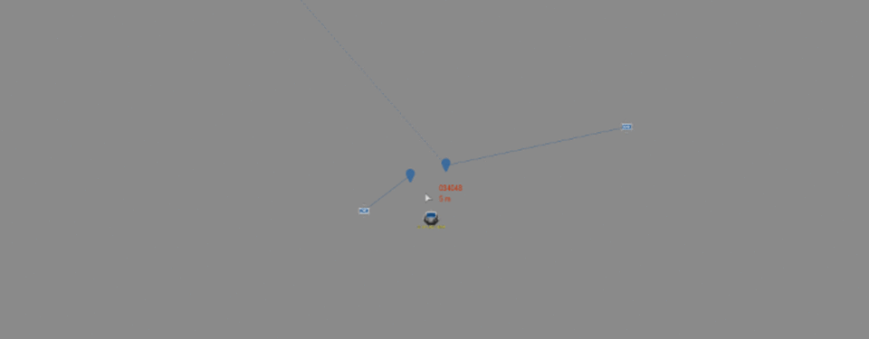

‘GO-CODE’ ACTIVATION

The top right corner of the map features buttons to activate any GO-CODES that units may be waiting for. GO-CODES will only be shown if they exist in the plans of your commanded units.

\_\_\_\_\_\_\_\_\_\_\_\_\_\_\_\_\_\_\_\_\_\_\_\_\_\_\_\_\_\_\_\_\_\_\_\_\_\_\_\_\_\_\_\_\_\_\_\_\_\_\_\_\_\_\_\_\_\_\_\_\_\_\_\_\_\_\_\_\_\_

STRATEGIC: PLAYER SQUAD

\_\_\_\_\_\_\_\_\_\_\_\_\_\_\_\_\_\_\_\_\_\_\_\_\_\_\_\_\_\_\_\_\_\_\_\_\_\_\_\_\_\_\_\_\_\_\_\_\_\_\_\_\_\_\_\_\_\_\_\_\_\_\_\_\_\_\_\_\_\_

1. FOLDABLE COMMAND-BAR

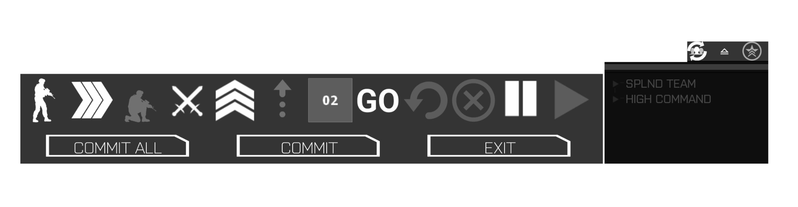

QUICK JUMP EXAMPLE: BUTTON 18

>> The idea was to go 1,2,3,4,5,6,7…. and have each number be it’s own bookmark

The COMMAND BAR unfolds when you select units of your own squad. It is currently used exclusively by SQUAD level.

BUTTONS 1-8 are the settings that will be applied to the next waypoint that you will place.

The available options are dependent on your selected unit’s gear.

You can cycle through the options using ‘Mouse Wheel’, or open sub-selections by clicking ‘Left Mouse Button’ on the button.

BUTTON [1]:  Travel Stance (Auto,Stand,Crouch,Prone)

BUTTON [2]:  Travel Speed

BUTTON [3]:  Arrival Stance (Auto,Stand,Crouch,Prone)

BUTTON [4]:  Engage (Default) / Disengage (disable targeting + autoDanger)

BUTTON [5]:  SQUAD ACTIONS\*

BUTTON [6]:  FORMATIONS / WAYPOINT ALIGNMENT\*

EDIT [7]:  WAYPOINT SPACING\*

BUTTON [8]:  WAYPOINT COMPLETION/CONDITIONS\*

BUTTONS 9 & 10 can be used to remove waypoints.

BUTTON [9]: Undo - remove last placed waypoint

BUTTON [10]: Delete

- LEFT MOUSE BUTTON: Delete Planning- Session

- CTRL + LEFT MOUSE BUTTON:  Delete Current WP / Skip To Next

- SHIFT + LEFT MOUSE BUTTON: Delete all waypoints (both active & planned)

BUTTONS 11 & 12 can be used to put your selected units in- and out of the STANDBY/HOLD state. Units in STANDBY/HOLD state will seek cover and wait for the order to CONTINUE,

BUTTON [11]: Order units to  HOLD/STAND BY

BUTTON [12]: Order units to  CONTINUE

BUTTONS 13-15  the lower button row,  is used to commit/confirm SQUAD level orders or exit the map.

COMMIT ALL [13] : WIP-Plans will be applied for all units in the player’s squad,  independent of current selection. This action can also be achieved by pressing ‘SPACE BAR’.

COMMIT [14]: WIP-Plans will be applied only to selected units.

EXIT [15]: Close the map.

2. TOP-ROW BUTTONS

The row of buttons above the ‘TeamColor Selectors’ contain three extra tools:

REFRESH [16]

The refresh function can be used if an unexpected event caused a desync between ARMA COMMAND and the game itself. An example for this would be a unit having an index of ‘2' in the game, but another one on the commanding tree and map-icons.

Click ‘Left Mouse Button’ on the REFRESH button to re-organize your group.  This will also restore a numerical order, which is useful if you have lost a lot of troops in battle.

DISBAND [17]

The DISBAND function will create a new group from your selected units, effectively moving them to HIGH COMMAND.

[FORCE TRACKER](#id.6b69dvj4mv19) [[18]](#id.6b69dvj4mv19)

Here you can toggle the display of any known units of other sides, friendly and enemy.

The tracker-icons can be used to assign targets to your current selection on SQUAD and HIGH COMMAND levels.

SQUAD-ACTIONS

The availability of actions is dependent on your units’ equipment.

GROUND ACTIONS:

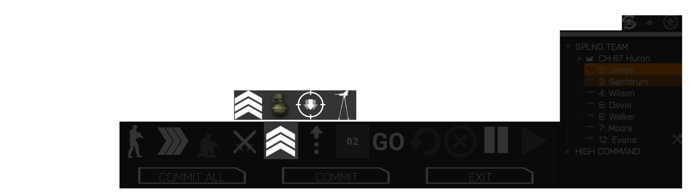

THROW: 

Select throwing item and click on desired position. You can place and drag the marker wherever you like, but the actual max throwing distance is approximately 30m.

SUPPRESS AREA: 

Click on the desired position. Adjust the polygon-area by dragging it’s center mark or edges.

To resize the entire area, hold ‘CTRL’ and drag the center mark up or down with ‘Left Mouse Button’ .

To adjust the polygon angle, hold ‘ALT’ and drag the center mark to your desired direction  with ‘Left Mouse Button’ .

Note: In strategic mode, the condition to end suppression is set via the COMMAND BAR’s conditions. It is not affected by the suppression-conditions you set with the SUPPRESSION MANAGER\*

ASSEMBLE STATIC WEAPON:

Press ‘Left Mouse Button’ where you want your static weapon to be assembled and drag the arrow-indicator in your desired direction.

DIS-ASSEMBLE STATIC WEAPON:

Dismount the gunner unit. Select two units (usually the gunner being one).

Now select the ‘Pack/Unpack Weapon’ and press ‘Left Mouse Button’ on the map. Drag the cursor over the popup-icon of the weapon you want to pack.

PLACE EXPLOSIVE (single unit only):

Press ‘Left Mouse Button’ around the rough area and drag the waypoint in the open or any vehicle’s popup-icon. Releasing the waypoint on top of an icon will make the unit attach the charge to that vehicle. Select the type of charge to place. Detonation of explosives with a remote is handled via the RADIAL MENU\*.

PICKUP (vehicles only):

Place a waypoint, then synchronize with the infantry unit’s waypoint or manually board them on arrival.

DROP-OFF (vehicles only):

Place a waypoint, cargo units will dismount on arrival.

AIRBORNE PAGE:

The hidden ‘AIRCRAFT’-Layer  of the COMMAND BAR is  automatically selected when you select an aircraft. It has a different, smaller layout than it’s ‘GROUND FORCES’-layer.

WAYPOINT FLYING-HEIGHT:

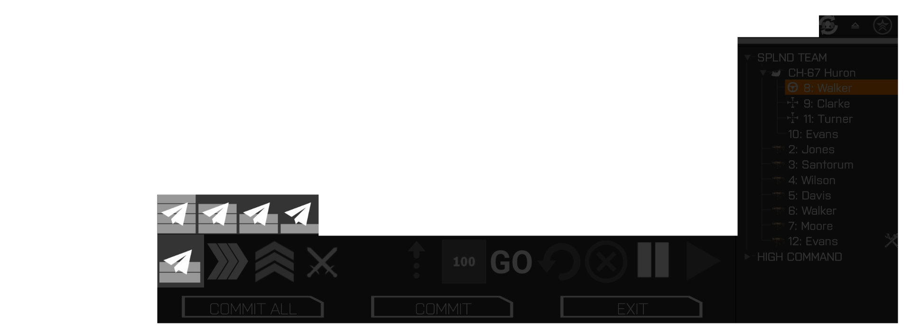

The ‘TRAVEL STANCE’ control is replaced by the ‘FLYING HEIGHT’ control. It has 4 options: 500m, 200m, 25m and a highly risky 5m option that is exclusively to be used in flat and empty terrain. Since you will, if at all, most likely have helicopters controlled by squad-AI, the maximum height can not exceed 500m as rotary aircraft do not seem to perform reliably within the game.

AIRCRAFT ACTIONS:

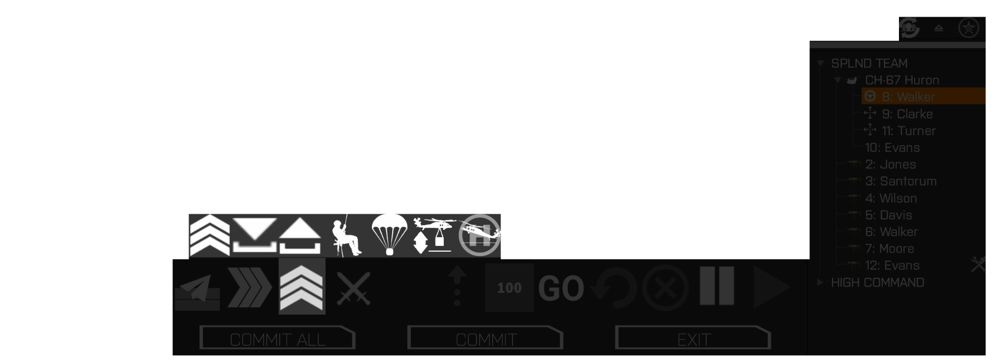

PICKUP:

Place a waypoint. Then, synchronize with an infantry unit’s waypoint (>> TO DO!!!!) or manually board them on arrival AFTER the landing is announced via chat.  Assign yourself as ‘aircraft-cargo’ using Arma 3‘s ACTION MENU.

DROP-OFF:

Place waypoint, cargo units (including players) will be ejected on arrival.

RAPPEL (Addon Dependent):

Place waypoint, cargo units (including players) will eject and rappel on arrival.

PARADROP:

Place waypoint on desired LZ.  Any cargo units or vehicles (including players) will eject and parachute on arrival.

SLING LOAD / DROP:

Press ‘Left Mouse Button’ around the rough waypoint area and drag the waypoint on any available popup-icons to select your cargo.

FULL LANDING:

Place waypoint on desired LZ. Helicopter will land and turn off it’s engine.

SQUAD-FORMATIONS

The formation is only relevant when using multiple selected units.  They work alongside the WAYPOINT SPACING setting.

The first three selections are all ‘Line’ formations, but distribute the waypoints and looking directions differently.

1. LINE STRAIGHT

The formation leader will take position and orient himself towards the waypoint’s looking direction. The remaining units will stack up behind the leader and take a 180-degree firing sector. Since building markers do not have accurate sizing and expected cover positions may not always work out, the waypoints will currently snap to suitable positions.

2. LINE RIGHT

The formation leader will take position and orient himself towards the waypoint’s looking direction. The remaining units will stack up in a line with 90 degrees to the right of the leader, while all facing into the same looking direction as the leader.

3. LINE LEFT

Same as LINE RIGHT. but with an orientation 90 degrees to the left

4. SPLIT FORMATION

Place waypoints for each selected unit, one by one. The placed waypoints are automatically synchronized, enabling you to create quick cover-to-cover maneuvers,

The SPACING setting is ignored for SPLIT FORMATION.

5. CIRCLE FORMATION

Press ‘Left Mouse Button’ on the map and drag it up and down to resize the displayed circle. Release Mouse Button when ready.

The SPACING setting is ignored for CIRCLE FORMATION.

WAYPOINT SPACING

This setting is only relevant when you have multiple units selected. It defaults to 2m for ground troops and 100m for helicopters, in order to avoid collisions.

WAYPOINT COMPLETION/CONDITIONS

By default, the waypoints have no condition other than arrival. The button displays ‘GO’, meaning ‘go immediately’.

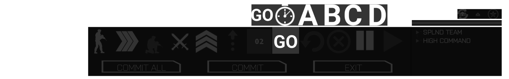

Click on the button to open the sub-selection, or cycle through the objects by scrolling ‘Mouse Wheel’ while hovering over the button.

You have a selection of ‘GO-CODES'\* and ‘TIMEOUT’\*. The latter opens a box where you can enter your desired length in seconds.

Certain actions (such as suppression) require an exit condition. Therefore the condition is set to ‘GO CODE D’ if no other condition was specified.

\_\_\_\_\_\_\_\_\_\_\_\_\_\_\_\_\_\_\_\_\_\_\_\_\_\_\_\_\_\_\_\_\_\_\_\_\_\_\_\_\_\_\_\_\_\_\_\_\_\_\_\_\_\_\_\_\_\_\_\_\_\_\_\_\_\_\_\_\_\_

STRATEGIC: HIGH COMMAND

\_\_\_\_\_\_\_\_\_\_\_\_\_\_\_\_\_\_\_\_\_\_\_\_\_\_\_\_\_\_\_\_\_\_\_\_\_\_\_\_\_\_\_\_\_\_\_\_\_\_\_\_\_\_\_\_\_\_\_\_\_\_\_\_\_\_\_\_\_\_

1. GROUP-MENU

The group menu can be opened by clicking ‘Right Mouse Button’ on the group’s map-icon.

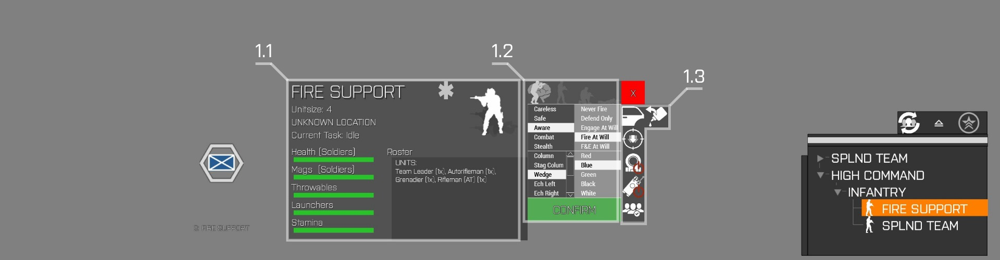

If multiple groups are selected, a limited version can be used to change settings for all selected groups.

Alternatively, you can hold CTRL and click ‘Right Mouse Button’ on the COMMAND TREE to open the GROUP MENU with all selected groups targeted .

The menu consists of two parts:

1.1 HIGH COMMAND DASHBOARD (single group selection only)

Shared with the RADIAL MENU, the dashboard gives you a quick overview of the group’s current status.

The map version also allows you to change the group’s callsign. Click on the Group-Name and enter your desired callsign. Use ‘CONFIRM’-Button or hit ‘ENTER’.

1.2 MAIN GROUP MENU

The group menu itself features list-boxes for default Arma Behaviour, CombatMode (ROE), Formations, as well as a custom color assignment for High Command forces.

You can set stances for infantry groups using the top row of buttons.

1.3 ACTION BAR

You also have a access to a set of immediate GROUP ACTIONS\*. The availability of those actions may depend on the group’s equipment.

Some actions require input data , which you will be asked to relay via map-click or a selection box.

2. WAYPOINT-MENU

The waypoint menu can be opened by clicking ‘Right Mouse Button’ on a waypoint icon.

The top bar shows you the waypoint’s group and index. The next set of list-boxes are used to assign Arma’s settings to the waypoint: Behaviour, Combat Mode, Speed and Formation.

COMPLETION

The ‘COMPLETION’ selection features GO-CODES, TIMEOUT, DAYTIME and simple ARRIVAL, meaning no additional condition.

WAYPOINT-TYPE / ACTION

Apart from a selection of standard Arma-Waypoints, the 'TYPE’ selection features a powerful array of GROUP ACTIONS that will be executed at the waypoint position. The selection may depend on the group’s equipment.  

LIST OF WAYPOINT ACTIONS:

The availability of actions depends on the unit’s gear.

- MOVE (Default)
- SEARCH & DESTROY
- AMBUSH (requires action-completion setting)
- FIRE SUPPORT (requires action-completion setting)
- DEMOLITION
- ASSEMBLE WEAPON (optional action-completion setting)
- ASSEMBLE UAV
- REPAIR
- TRANSPORT UNLOAD
- LAND
- COMBAT LAND (requires action-completion setting)
- RAPPEL
- PARADROP (infantry and vehicles, works with VTOLs)
- SLING LOAD
- SLING DROP
- CAS-STRIKE (Jets only)
- LOITER
- HELICOPTER OVERWATCH (attack helicopters only)
- CYCLE

ADDITIONAL WAYPOINT ACTIONS:

- CLEAR BUILDING (Inf only. Drag existing waypoint on top of a building marker)
- BOARD / LOAD VEHICLE (synchronize waypoints of loading- and cargo-group)

Some actions require completion conditions of their own. These are separated from the waypoint’s own completion to give you more planning flexibility. For example, you may want to move units in position to suppress, while waiting for your ‘GO CODE’ to engage.

The CONFIRM button will apply your changes to the waypoint, the DELETE waypoint will remove the waypoint. The little red ‘X’ button in the top right closes the waypoint-menu.

WAYPOINT AND ACTION CONDITIONS

Waypoint conditions are generally the same for SQUAD and HIGH COMMAND modes, while the availability throughout the interfaces may differ.

Conditions may be applied to waypoints or actions.

TIMEOUT:

Units or groups will move to the waypoint position or execute the action, waiting  for

X-seconds before proceeding.

GO-CODE:

Units or groups will move to the waypoint position or execute the action, waiting for a player to trigger the corresponding GO-CODE.

Available options are ‘A’, ‘B’, ‘C’ and ‘D’.

‘GO-CODE D’, being the most unlikely to be used, is reverted to as a default for actions that require an exit condition (example: Suppression Action')

DAYTIME (High Command only):

Groups will move to the waypoint position or execute the action, waiting for the selected daytime. This condition can be used to create a timeline, for example when planning large scale attacks or resupply missions.
