\_\_\_\_\_\_\_\_\_\_\_\_\_\_\_\_\_\_\_\_\_\_\_\_\_\_\_\_\_\_\_\_\_\_\_\_\_\_\_\_\_

PART 3: TACTICAL MODE (HIGH COMMAND)

\_\_\_\_\_\_\_\_\_\_\_\_\_\_\_\_\_\_\_\_\_\_\_\_\_\_\_\_\_\_\_\_\_\_\_\_\_\_\_\_\_

Tactical mode enables you to quickly control your HIGH COMMAND assets in 3D space. This is achieved via the HIGH COMMAND layer of the RADIAL MENU\* which you are already familiar with.

Any mission begins with SQUAD LEVEL. If you have HIGH COMMAND units under your command, you can switch to HIGH COMMAND MODE by pressing ‘CTRL + SHIFT’.

As you switch to HIGH COMMAND, your squad-bar is hidden and high command groups display a group icon above their leader’s vehicle. You do not lose control of your own squad while you are operating in HIGH COMMAND mode.

Opening the radial menu on HIGH COMMAND level displays  a secondary layer, which shares the main layout with it’s SQUAD LEVEL counterpart. The ‘sergeant’ badge is replaced by a ‘colonel’ badge for additional feedback.

GROUP SELECTION:

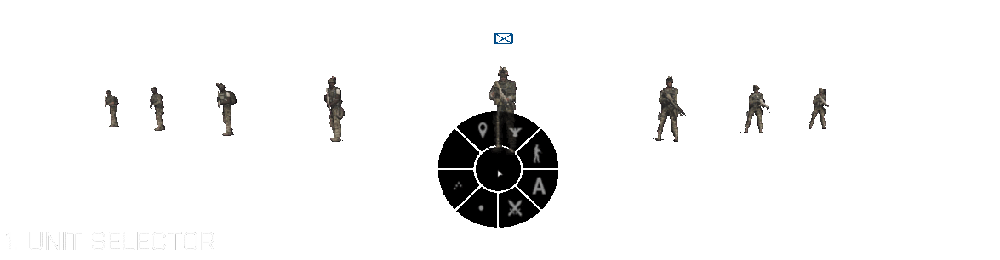   1. UNIT SELECTOR

Hidden by default, you can toggle the selector by hovering your mouse over the left area of your screen. Units are sorted by leader’s vehicle types, making it easier to quickly find a unit even when controlling a large scale force.

2. BUTTON-CLICK SELECTION

You can directly click on one of the  group’s vehicles or it’s 3D-icon. ‘Left Mouse Button’ will select a group individually, ‘Right Mouse Button’ will add or remove a unit from the selection.

3. TOGGLE SELECTION MODE

You can temporarily hide the radial menu by pressing down the ‘Q’ key. This provides space if the radial menu interferes with your desired selection.

---

MOVE / WAYPOINT

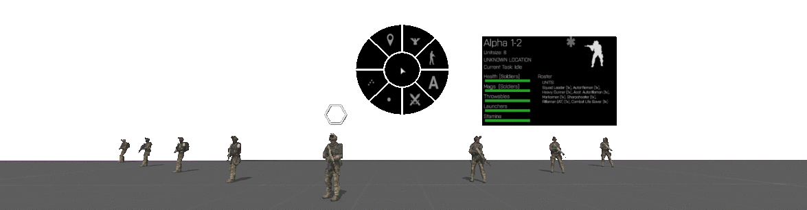With your group(s) selected, click the ‘MOVE’ action and keep your TAB-key pressed.

Drag the waypoint indicator to your desired position and confirm by hitting ‘SPACE BAR". To cancel, release TAB without confirming.

You can use this mechanic with multiple groups simultaneously. If you place a multi-waypoint in the open, waypoints will be distributed in a wedge formation which you can adjust to your liking. If you place the waypoint on a road, waypoints will be aligned with the road and the convoy PID is triggered, just like in STRATEGIC mode.

STANCES

Stances will affect all infantry units within the group.

---

GO-CODES

Here you can toggle any active GO-CODE while using HIGH COMMAND mode. The functionality is the same as it is everywhere else.

COMBAT MODE

Assign Arma 3‘s default combat modes (ROE) to the group - “BLUE”, “GREEN”, “WHITE”, “YELLOW” and “RED”.

BEHAVIOUR

Assign Arma 3‘s default behaviours to the group - “CARELESS”, “SAFE”, “AWARE”, “COMBAT” and “STEALTH”.

For more information on behaviour and combat modes please refer to the BIS-community wiki.

---

FORMATIONS

Set the selected group’s formation, just as you do for squad level. Formation Names are displayed in the tooltip when hovering over the icons.

HIGH COMMAND ACTIONS:

Once again, the AI-actions are the centerpiece of HC-TACTICAL. Here you access the full range of AI actions, in an immediate version that can be ordered with the advantage of seeing the AO.

The availability of actions depends on the selected units gear. Some actions are only available to single unit selections, others can be used with multiple groups simultaneously.

BOARD VEHICLE:

This button is used for all boarding commands:

BOARD GROUP: Click the action with ‘Left Mouse Button’. Keep TAB pressed, look at the desired vehicle and confirm with Spacebar.

DISMOUNT GROUP: Click the action with ‘Right Mouse Button’.

DISMOUNT CARGO GROUPS: Hold CTRL and click the action with ‘Right Mouse Button’.

VEHICLE REBOARD:

Use this action to make groups mount up their last vehicles, instead of going through the entire boarding process again.

SUPPRESSION / FIRE SUPPORT:

Click the action, keep TAB pressed and drag the icon to your target position. Confirm with Space Bar, cancel by releasing TAB. The suppressed area can be modified via it’s map-polygon.

STOP SUPPRESSING:

Cancel any suppression action for your selected units.

CAS-STRIKE:

Order a precise airstrike (Jets only). Click the action, keep TAB pressed down and select the CAS-type. If the group was stationary, it will receive orders to return to base. If the aircraft was on the ground, it will land at its airfield or carrier.

LAND:

Make jets and helicopters land around your selected position.

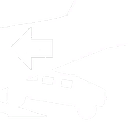LOAD VEHICLE:

Load a vehicle into another vehicle’s cargo space.

Click the action, keep TAB pressed and select the vehicle you want to load.

PARADROP:

Paradrop any loaded units or vehicle cargo.

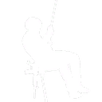RAPPEL (ADDON DEPENDENT):

Click the action, keep TAB pressed and drag the icon to your rappel position. If the aircraft is stationary, it will receive a second waypoint to RTB after completing the rappel action. If it was on the ground, the aircraft lands at its original position.

FLYING HEIGHT:

To set an aircraft’s flying height, click the action, keep TAB pressed and select your desired flying height.

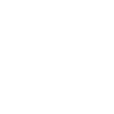REPAIR:

Repair any vehicles within a 100m radius. Click the action, keep TAB pressed and drag the icon to your desired vehicle. Confirm with ‘Space Bar’, cancel by releasing TAB.

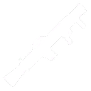FIRE AT/AA MISSILE

Click the action, keep TAB pressed and drag the icon to your desired target or position. Confirm with ‘Space Bar’, cancel by releasing TAB.

A suitable unit with line of sight on the target will be selected to fire a rocket. Lockable missiles will lock to targeted vehicles.

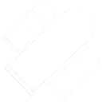FIRE UGL LAUNCHER

Click the action, keep TAB pressed and drag the icon to your desired position. Confirm with ‘Space Bar’, cancel by releasing TAB.

A suitable unit with line of sight on the target will be selected to fire a grenade from it’s underslung launcher. Ammo-types are not considered, the AI will fire it’s currently loaded magazine.

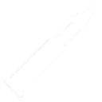FIRE STATIC MISSILE LAUNCHER

Click the action, keep TAB pressed and drag the icon to your desired target or position. Confirm with ‘Space Bar’, cancel by releasing TAB.

FIRE TANK-SHELL

Click the action, keep TAB pressed and drag the icon to your desired target or position.

Confirm with ‘Space Bar’, cancel by releasing TAB.

A tank with sight on the target will engage vehicles with  armor piercing rounds, while positions are engaged with high explosive rounds.

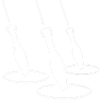FIRE ARTILLERY

Click the action, keep TAB pressed and drag the icon to your desired target or position.  Confirm by pressing ‘Space Bar’, keep TAB pressed as you select ammo-type and shell-amount. Cancel at any time by releasing TAB.

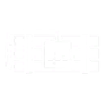PLACE EXPLOSIVES

Click the action, keep TAB pressed and drag the icon to your desired target or position. Select the desired ammo-type while still keeping TAB pressed. Confirm with ‘Space Bar’, cancel by releasing TAB.

Placed remote-charges can then be detonated via the ‘DETONATE EXPLOSIVES’ action.

DETONATE EXPLOSIVES

Click the action, keep TAB pressed and detonate your charges individually, or all at once. Charges will detonate within one second after the order was given, it is not immediate.

Cancel by releasing TAB.

ASSEMBLE STATIC WEAPON

The action’s icon displays the first available weapon you can assemble.

Click the action, keep TAB pressed and drag the popup-vehicle to your desired position. Rotate the weapon with ‘Mousewheel’. Confirm with ‘Space Bar’, cancel by releasing TAB.

DISASSEMBLE STATIC WEAPON

Click the action, keep TAB pressed and select the weapon to disassemble. If you opened the radial menu while looking at the weapon, it will be selected automatically.

TOGGLE IR-STROBES

Infantry units and vehicles will attach or detach an IR-strobe, distinguishing them from the enemy when using night vision.

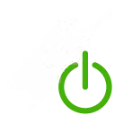TOGGLE IR-LASERS

Suitable infantry units will engage or disengage their gun’s mounted IR-Lasers. Compatible with dual items from RHS and SMA.

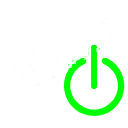TOGGLE GUN-LIGHTS

Suitable infantry units will engage or disengage their gun’s mounted flashlights. Compatible with dual items from RHS and SMA.

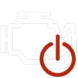ENGINE OFF

Turn off engines to limit noise to conceal your troops and expose enemy movement.

SPEED LIMIT

Limit the speed to one of four options. The speeds are tuned with the games’ infantry speed values, enabling a player controlled squad to follow a vehicle through urban terrain (works well with staggered column formation).

CREATE CONVOY GROUP

Selected units are structured into a convoy group. Use this method of convoy if you want to skip micromanagement when moving troops across the map.

REJOIN CONVOY GROUP

Split the joined convoy groups back into its original groups.

UNSTUCK

Units and vehicles within the group will be teleported to a closby empty position or road. Essentially a ‘immersion breaker’, this function aims to remedy the problems of another immersion breaker - units getting stuck.
